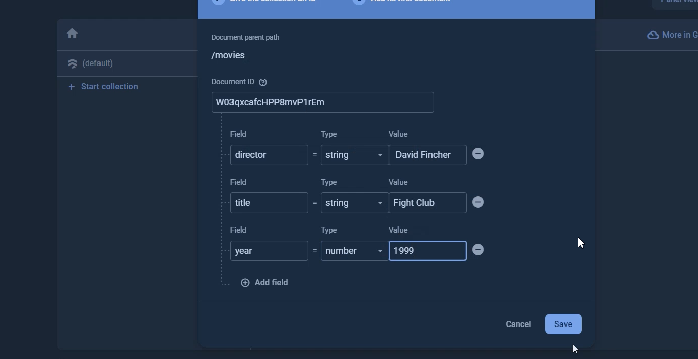
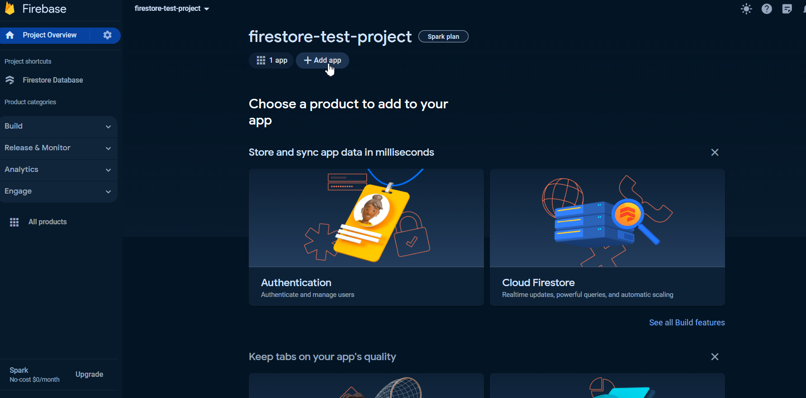

**Виконав:**
_студент 2-го курсу, групи ІМ-24:_

<span padding-right:5em></span> **Корник Ілля** [Пошта: i.kornyk.im24@kpi.ua]

**Керівник**

_доцент кафедри ОТ ФІОТ, к.т.н., доцент_<span padding-right:5em></span> **Андрій БОЛДАК**

[НТУУ "КИЇВСЬКИЙ ПОЛІТЕХНІЧНИЙ ІНСТИТУТ імені ІГОРЯ СІКОРСЬКОГО](https://kpi.ua/)

[Факультет інформатики та обчислювальної техніки](https://fiot.kpi.ua/)

[Кафедра обчислювальної техніки](https://comsys.kpi.ua/)

Київ

# Хмарна база даних Firestore

## Firestore


_Google Cloud Firestore_ — це документно-орієнтована, NoSQL база даних, яка дозволяє легко зберігати, синхронізувати та отримувати дані для ваших мобільних програм і вебдодатків у будь-якому куточку світу. Це повністю керована хмарна служба баз даних, що робить її частиною служби «База даних як послуга» (DBaaS), яка надається в Google Cloud. За допомогою Firestore Google керує інфраструктурою баз даних, дозволяючи розробникам зосередитися на своїх додатках, а не на управлінні складними процесами баз даних. Ця база даних забезпечує автоматичне масштабування, високу продуктивність і простоту розробки додатків, що робить його чудовим вибором для багатьох типів застосунків.

_База даних як послуга (DBaaS)_ - це модель хмарних обчислень, яка надає користувачам певну форму доступу до бази даних без необхідності налаштування фізичного обладнання, встановлення програмного забезпечення або конфігурації для підвищення продуктивності. Провайдери DBaaS керують основною інфраструктурою, що дозволяє користувачам економити час і ресурси на управлінні базами даних і більше зосереджуватися на логіці роботи додатків. Це вигідно для бізнесу, оскільки знижує загальну вартість утримання, покращує масштабованість і гнучкість, а також забезпечує високу доступність і безпеку даних.

У контексті Google Cloud, Firestore є однією з декількох пропозицій DBaaS, які також включають Google Cloud SQL, Google Cloud Spanner та Google Cloud Bigtable, зокрема. Кожен з цих сервісів орієнтований на різні сценарії використання та моделі даних, надаючи користувачам широкий спектр можливостей для задоволення їхніх конкретних потреб.

## Особливості Firestore

1. **NoSQL**: Firestore - це NoSQL база даних документів, що означає, що вона зберігає дані у гнучкому, JSON-подібному форматі. На відміну від традиційних реляційних баз даних, Firestore дозволяє зберігати складні ієрархічні структури даних у кожному документі, що полегшує організацію та пошук даних

2. **Автоматичне масштабування**: Firestore має функцію автоматичного масштабування. Він може швидко масштабуватися, щоб впоратися зі стрибками навантаження, а потім зменшити обчислювальні потужності, коли трафік спадає, забезпечуючи ефективне використання ресурсів.

3. **Висока продуктивність**: Firestore розроблений для забезпечення високої продуктивності для великомасштабних додатків. Він пропонує низьку затримку для операцій з базами даних, що робить його придатним для додатків у режимі реального часу.

4. **Простота розробки додатків**: Firestore надає багатий набір клієнтських бібліотек та SDK, що дозволяє легко інтегрувати Firestore у ваші додатки. Він також підтримує збереження даних в офлайн-режимі, що дозволяє вашим додаткам працювати навіть без підключення до Інтернету.

5. **Оновлення в режимі реального часу**: Firestore дозволяє відстежувати зміни в базі даних в режимі реального часу, що робить його ідеальним для додатків, які потребують оновлень в реальному часі.

6. **Безпека**: Firestore надає надійні функції безпеки. Ви можете використовувати Firebase Authentication та Cloud Identity та Access Management (IAM) для контролю доступу до вашої бази даних.

7. **Інтеграція з Firebase та Google Cloud**: Firestore є частиною платформи Firebase і легко інтегрується з іншими сервісами Firebase та Google Cloud, що дозволяє створювати комплексні рішення.

## Модель даних Firestore:


Firestore - це NoSQL, документно-орієнтована база даних. На відміну від традиційних баз даних SQL, у Firestore немає ні таблиць, ні рядків. Замість цього ви зберігаєте дані в документах, які організовані в колекції. Кожен документ містить набір пар ключ-значення.

**Документи**:
У Firestore одиницею зберігання є документ. Документ - це легкий запис, що містить поля, які відповідають значенням. Кожен документ має унікальну назву. Документи можуть містити складні вкладені об'єкти, які називаються картами (maps), а також можуть містити внутрішні колекції (subcollections).

**Колекції**:
Документи живуть у колекціях, які є просто контейнерами для документів. Колекція містить лише документи та нічого більше. Вона не може безпосередньо містити сирі поля зі значеннями та не може містити інші колекції.

**Внутрішні колекції**:
Документи можуть містити вкладені колекції, які є колекціями, що належать документу. Вкладені колекції можуть містити документи, а ті документи можуть містити власні вкладені колекції, що дозволяє створювати складні ієрархічні структури даних.

Firestore не має схем, тому ви маєте повну свободу у виборі полів у кожному документі й типів даних, які ви зберігаєте в цих полях. Документи в одній колекції можуть містити різні поля або зберігати різні типи даних у цих полях. Проте, рекомендується використовувати однакові поля і типи даних у кількох документах, щоб полегшити створення запитів до документів.

## Продуктивність

Firestore - це може працювати з великими обсягами даних і великою кількістю користувачів. Firestore пропонує низьку затримку при роботі з базами даних, що робить його придатним для додатків, які працюють в режимі реального часу. Firestore також забезпечує високу пропускну здатність для операцій читання і запису, що дозволяє швидко обробляти великі обсяги даних.

Продуктивність Firestore залежить від декількох факторів, таких як розмір і складність запитів, кількість і розмір документів, кількість і тип індексів, а також мережева затримка між клієнтами та базою даних. Щоб оптимізувати продуктивність Firestore, слід дотримуватися найкращих практик для Firestore, таких як уникнення одноманітного нарощування ідентифікаторів документів, використання точних запитів та обмеження кількості індексів.

Для вимірювання та моніторингу продуктивності Firestore ви можете використовувати різні інструменти та методи, такі як

Key Visualizer: Key Visualizer - це інтерактивний інструмент моніторингу продуктивності Firestore, який генерує візуальні звіти на основі документів Firestore, до яких здійснювався доступ протягом певного часу. Він допоможе вам зрозуміти та оптимізувати шаблони доступу до вашої бази даних, а також усунути проблеми з продуктивністю.


Метрики часу виконання служби: Метрики часу виконання служби - це показники, які вимірюють продуктивність базової інфраструктури Firestore, такі як завантаження процесора, використання пам'яті та мережевого трафіку. Ви можете переглядати та аналізувати ці показники за допомогою Cloud Monitoring.


Інструменти бенчмаркінгу: Інструменти бенчмаркінгу - це інструменти, які моделюють різні робочі навантаження і сценарії для вашої бази даних Firestore, такі як швидкість читання і запису, затримки та масштабованість. Ви можете використовувати ці інструменти для тестування і порівняння продуктивності Firestore з іншими службами баз даних або з вашими власними очікуваннями. Деякі приклади інструментів бенчмаркінгу: fio3 і Firebase Performance


## Масштабованість

Firestore використовує складні методи балансування навантаження та розділення даних для рівномірного розподілу робочого навантаження по всій інфраструктурі, що робить його потужним рішенням як для невеликих, так і для великих додатків.

Firestore доступний у регіональних або мультирегіональних конфігураціях по всьому світу, а це означає, що ви можете обирати, де зберігати дані, виходячи з ваших вимог до затримок, доступності та довговічності. Firestore також дублює ваші дані між кількома центрами обробки даних у різних регіонах, забезпечуючи високу надійність та узгодженість.

Для впорядкування та зберігання даних Firestore використовує техніку, яка називається розбиття діапазону на частини (range sharding). Це означає, що Firestore розбиває ваші дані на менші фрагменти, так звані шарди, на основі лексикографічного порядку ключів ваших документів. Firestore динамічно регулює кількість і розмір шардів на основі розподілу і моделей доступу до ваших даних, забезпечуючи оптимальну продуктивність і масштабованість.

## Безпека:

Firestore - це безпечна служба баз даних, яка захищає ваші дані від несанкціонованого доступу та зловмисних атак. Firestore надає наступні функції безпеки:

_Шифрування даних_:Firestore шифрує ваші дані в стані зберігання та під час передачі: За замовчуванням Firestore використовує ключі шифрування, керовані Google, але ви також можете використовувати власні ключі шифрування за допомогою Cloud Key Management Service.

- **Керування доступом**: Firestore дозволяє контролювати, хто може отримати доступ до ваших даних і які операції вони можуть над ними виконувати. Ви можете використовувати автентифікацію Firebase і правила безпеки Firestore для керування безсерверною автентифікацією, авторизацією та перевіркою даних для мобільних і вебдодатків. Ви можете використовувати Identity та Access Management (IAM) для керування доступом до вашої бази даних для серверних додатків і адміністраторів.

- **Сертифікати відповідності**:Firestore відповідає різним галузевим стандартам і нормам, таким як ISO, SOC, PCI DSS, HIPAA і GDPR. Firestore також підтримує вимоги щодо резидентності та суверенітету даних, дозволяючи вам обирати, де зберігати ваші дані.

**Вартість**:

Firestore стягує плату за наступні аспекти використання вашої бази даних:

- Кількість документів, які ви читаєте, записуєте та видаляєте.
- Обсяг пам'яті, який використовує ваша база даних, включаючи накладні витрати на метадані та індекси.
- Обсяг пропускної здатності мережі, яку ви використовуєте.

Вартість кожного аспекту залежить від декількох факторів, таких як розташування вашої бази даних, розмір і складність ваших запитів, кількість і розмір ваших документів, а також кількість і тип ваших індексів.Ви можете скористатися калькулятором цін Google Cloud, щоб оцінити витрати на Firestore залежно від очікуваного використання.

Щоб зменшити витрати на Firestore, слід дотримуватися найкращих практик для Firestore, таких як

- Уникайте великих або частих записів, зчитувань і видалень.
- Використання точних запитів та обмеження кількості результатів.
- Використання методів стиснення та нормалізації даних для зменшення розміру документів та індексів.
- Видалення або архівування невикористаних або старих даних.
- Вибір регіонального або міжрегіонального розташування, яке є близьким до ваших користувачів і відповідає вашим вимогам щодо доступності та довговічності.

## Приклади використання

Firestore - це універсальна служба баз даних, яка може підтримувати широкий спектр додатків і сценаріїв використання. Деякі з типових сценаріїв використання Firestore є наступними:

- **Веб- та мобільна розробка**: Firestore ідеально підходить для швидкої, гнучкої та масштабованої веб- та мобільної розробки, оскільки забезпечує пряме підключення до бази даних, синхронізацію даних у режимі реального часу, збереження даних в автономному режимі та простоту інтеграції додатків. Firestore може забезпечити роботу таких додатків, як соціальні мережі, електронна комерція, ігри, чати тощо.
- **Охорона здоров'я**: Firestore може допомогти медичним установам розробляти мобільні додатки, які інформують громадськість, підтримують первинну самодіагностику вірусів та дозволяють мешканцям зв'язуватися з медичними працівниками.

Firestore також може забезпечити безпечне та відповідне вимогам зберігання та аналіз даних для медичних додатків, таких як електронні медичні картки, телемедицина та медичні дослідження.

- **Інтернет речей (IoT)**:Firestore може обробляти великі обсяги даних з пристроїв IoT, таких як датчики, камери та інтелектуальні прилади. Firestore також може надавати оновлення в режимі реального часу та автономну підтримку для додатків IoT, таких як "розумний дім", "розумне місто" і "розумне сільське господарство".
- **Медіа та розваги**: Firestore може зберігати та передавати медіаконтент, наприклад, зображення, відео та аудіо, для медіа та розважальних додатків, таких як онлайн-платформи відео, потокові музичні сервіси та подкасти. Firestore також може надавати такі функції, як персоналізація контенту, рекомендації та рейтинги.

## Як користуватися Firestore

Перш за все нам потрібно мати обліковий запис Google

Далі заходимо на сайт [Firebase](https://console.firebase.google.com)
Та натискаємо "Create a project"


Даємо ім'я нашому проєкту


Для тестового проєкту не підключаємо аналітику


Firebase створює наш проєкт


Проєкт створено


Далі ми опиняємося на головній сторінці нашого проєкту


Гортаємо трішки вниз та натискаємо на опцію "Cloud Firestore"


У Cloud Firestore натискаємо "Create database"


Налаштовуємо нашу базу даних. Можна змінити регіон, де наші дані будуть зберігатися.
Я обираю **eur_3 (Europe)**


Далі йдуть налаштування безпеки, я обираю тестовий варіант


Наша база даних створена. Тепер з нею можна працювати.


Створимо колекцію. Для цього натискаємо на опцію "Start collection"


Задаємо ім'я для колекції


Налаштовуємо наш запис, документ. Додаємо значення.
Натискаємо на "Save"


Отримуємо документ у нашій колекції.


Щоб під'єднати наш додаток до Firebase та використати Firestore
переходимо на головну сторінку проєкту та вибираємо опцію "Add app".
Після чого вибираємо потрібний тип додатка. Я продемонструю роботу з web app.


Далі налаштовуємо параметри для додатка. Та натискаємо на "Register app"


Далі Firebase дає нам деякі інструкції щодо підключення нашої бази даних до додатка.
Зверніть увагу на Firebase configuration зміну, вона містить api ключ для підключення нашого додатка до
бази даних.


Я створив простий вебдодаток за допомогою фреймворку React.js для демонстрації інтеграції Firebase та вебдодатка.

_useAddMovie.tsx_

```tsx
import { useState } from "react";
import { collection, addDoc, getFirestore } from "firebase/firestore";
import { initializeApp, FirebaseError } from "firebase/app";

// Your web app's Firebase configuration
const firebaseConfig = {
  apiKey: process.env.REACT_APP_API_KEY,
  authDomain: process.env.REACT_APP_AUTH_DOMAIN,
  projectId: process.env.REACT_APP_PROJECT_ID,
  storageBucket: process.env.REACT_APP_STORAGE_BUCKET,
  messagingSenderId: process.env.REACT_APP_MESSAGING_SENDER_ID,
  appId: process.env.REACT_APP_APP_ID,
};

// Initialize Firebase
const app = initializeApp(firebaseConfig);

// Get a reference to your Firestore database
const db = getFirestore(app);

// Get a reference to your movies collection
const moviesCollection = collection(db, "movies");

export type TMovieRecord = {
  director: string;
  title: string;
  year: number;
};

const useAddMovie = () => {
  const [loading, setLoading] = useState(false);
  const [error, setError] = useState<string | null>(null);

  const addMovie = async (movie: TMovieRecord) => {
    setLoading(true);
    setError(null);
    try {
      const docRef = await addDoc(moviesCollection, movie);
      console.log("Document written with ID: ", docRef.id);
    } catch (e) {
      console.error("Error adding document: ", e);
      if (e instanceof FirebaseError) {
        setError(e.message);
      }
    } finally {
      setLoading(false);
    }
  };

  return { addMovie, loading, error };
};

export default useAddMovie;
```

_MovieForm_

```tsx
import useAddMovie, { TMovieRecord } from "../../hooks/useAddMovie";

export function MovieForm() {
  const { addMovie, loading, error } = useAddMovie();

  const handleSubmit = (event: React.FormEvent<HTMLFormElement>) => {
    event.preventDefault();

    const formData = new FormData(event.currentTarget);
    const title = formData.get("title");
    const director = formData.get("director");
    const year = Number(formData.get("year"));

    if (
      typeof title === "string" &&
      typeof director === "string" &&
      typeof year === "number"
    ) {
      const movie: TMovieRecord = {
        title,
        director,
        year,
      };
      addMovie(movie);
    }
  };

  return (
    <form className="movie-form" onSubmit={handleSubmit}>
      <input
        className="movie-input"
        name="title"
        placeholder="Title"
        required
      />
      <input
        className="movie-input"
        name="director"
        placeholder="Director"
        required
      />
      <input className="movie-input" name="year" placeholder="Year" required />
      <button className="movie-button" type="submit" disabled={loading}>
        {loading ? "Loading..." : "Add Movie"}
      </button>
      {error && <div className="movie-error">Error: {error}</div>}
    </form>
  );
}
```

_App.tsx_

```tsx
import "./App.css";
import { MovieForm } from "./components/MovieForm";

function App() {
  return (
    <div className="App">
      <MovieForm />
    </div>
  );
}

export default App;
```

Протестуємо роботу додатка додавши новий запис у базу даних.


Отримуємо новий запис у базі.


## Висновок

Firestore - це хмарний сервіс баз даних NoSQL, який забезпечує швидке і масштабоване зберігання та синхронізацію даних для веб- і мобільних додатків. Firestore має багато функцій, які роблять його потужним і гнучким вибором для багатьох типів додатків, таких як автоматичне масштабування, висока продуктивність, простота розробки додатків, безпека та інтеграція з Firebase і Google Cloud. Firestore - це чудовий вибір для розробників, які хочуть створювати додатки, що можуть рости разом з користувачами та даними, не турбуючись про базову інфраструктуру або складність масштабування. Firestore також надає інструменти та метрики, які допоможуть вам контролювати та оптимізувати продуктивність вашої бази даних.
